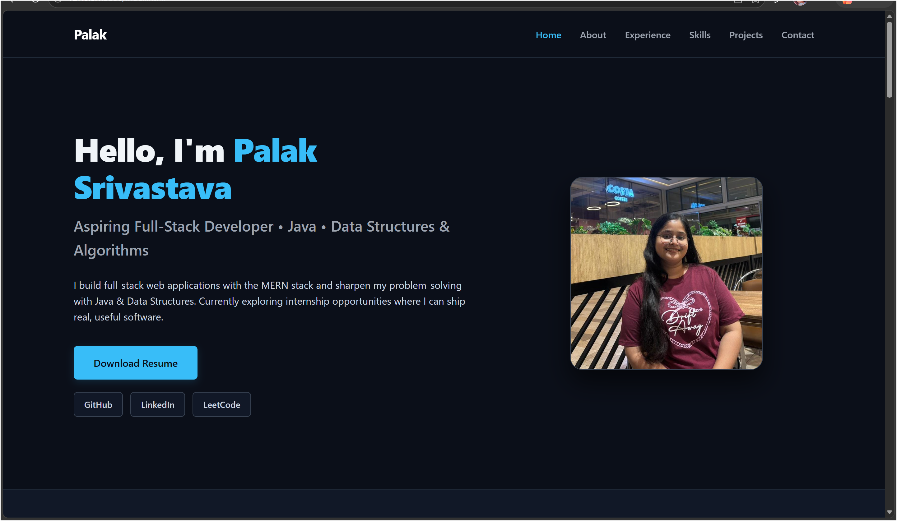

# 🌐 Palak Srivastava - Portfolio

A responsive personal portfolio website showcasing my projects, technical skills, achievements, and experience as an aspiring Full Stack Developer.


## 📌 About

This portfolio highlights:

- 👩‍💻 My technical skills
- 💼 Projects
- 🏆 Experience & Achievements
- 📚 Current Learning
- 📬 Contact Information

The website is fully responsive and designed with a modern UI to provide a clean browsing experience.

---

## 🛠️ Tech Stack

- HTML5
- CSS3
- JavaScript
- Git & GitHub

---

## ✨ Features

- Responsive design
- Modern dark theme
- Smooth navigation
- Hero section
- About section
- Skills showcase
- Experience timeline
- Featured projects
- Contact section
- Resume download
- Social media links

---

## 📂 Featured Projects

### 🌍 Wanderlust
A full-stack travel listing application built using Node.js, Express.js, MongoDB, EJS, Passport.js, and Bootstrap featuring authentication, authorization, image uploads, reviews, and CRUD operations.

### 💬 Mini WhatsApp (Backend CRUD)
Backend project demonstrating CRUD operations using Node.js, Express.js, MongoDB, and Mongoose with RESTful routing.

### 📷 Photography Website
A responsive photography portfolio website with a modern and elegant UI.

### 🎮 Simon Says Game
A JavaScript memory game built using DOM manipulation and CSS animations.

---

## 📁 Folder Structure

```
Portfolio/
│── index.html
│── style.css
│── images/
│── PalakResume.pdf
└── README.md
```

---

<h2>📸 Preview</h2>

<p align="center">
  
</p>

## 📥 Installation

Clone the repository

```bash
git clone https://github.com/palaksrivastava2311/CodeAlpha-MyPortfolio.git
```

Go to the project folder

```bash
cd Portfolio
```

Open `index.html` in your browser.

---

## 📫 Connect With Me

- GitHub: https://github.com/palaksrivastava2311
- LinkedIn: https://www.linkedin.com/in/palak-srivastava-282057336/
- LeetCode: https://leetcode.com/u/palaksrivastava2311/

---

## 📄 License
This project is created for learning and portfolio purposes as part of my internship work.
